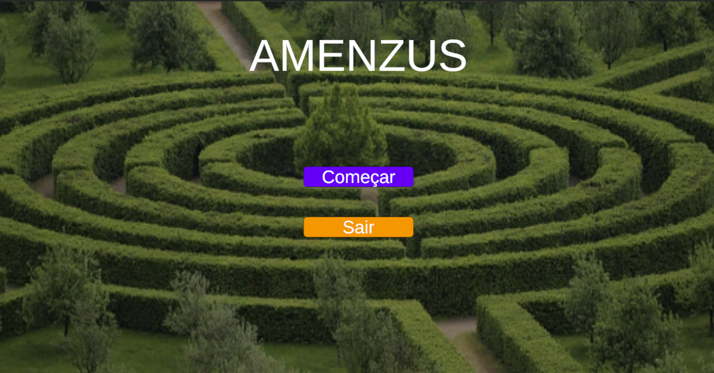
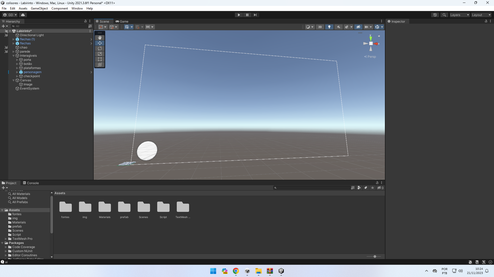

# labirintoHUD

## Autores
Gabriele Batista Sousa e Filipe Custodio Gonçalves 

## Descrição 
Esse é um projeto requisitado pela orientadora Aline Firmino com o objetivo de criar um HeadsUpDisplay para o projeto dos colisores.

## Requisitos de instalação
Para testar o projeto será necessário ter versão `2021.3.6f1` do Unity.

## instalação 
Clonar esse projeto do github 
e abrir o projeto no unity.

## desenvolvimento do projeto
1. Criar cena do menu.



2. Criar um elemento canvas com dois botões e um texto de titulo.

3. Cria um script de gestão das cenas.

4. Relacionar funções de script ao botão.
```ruby
   //entrar na cena do jogo
   public void Entrar(){
        SceneManager.LoadScene("Scenes/Labirinto");
    }
    //fecha a aplicação
    public void Sair(){
        Application.Quit();
    }
    //volta ao menu
    void OnTriggerEnter(Collider other){ 
        Cursor.visible = true;
        Cursor.lockState = CursorLockMode.None;
        SceneManager.LoadScene("Scenes/Menu");
        Debug.Log("ai");
    }
```

5. Na cena do jogo, adicionar um elemento canvas com uma imagem.



6. Adicionar uma função a um colisor para mudar a cor da imagem para a cor do botão mais próximo.

```ruby
  //se estiver em colisão, muda de cor.
  void OnTriggerStay(Collider other){ 
        if(other.gameObject.tag == "jogador"){
            sensor.GetComponent<Image>().color = cor;
        }
    }
  //ao sair, muda para branco
    void OnTriggerExit(Collider other){ 
        if(other.gameObject.tag == "jogador"){
            sensor.GetComponent<Image>().color = new Color(255,255,255,255);
        }
    }
```

7. Adicionar um colisor no final do labirinto com o script de gestão da cena para retornar ao menu.
